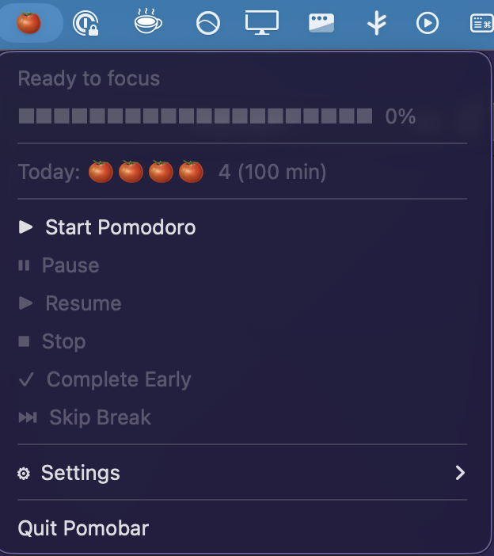

# 🍅 Pomobar

A native macOS menubar Pomodoro timer built with Rust. Lightweight, distraction-free, and lives right in your menubar.


[](https://github.com/danielmschmidt/pomobar/actions/workflows/ci.yml)


## Screenshots

<p align="center">
  
</p>


## Features

- **🍅 Menubar Timer** - Shows countdown directly in your menubar (🍅 25:00)
- **⏸ Pause & Resume** - Pause your pomodoro when interrupted
- **☕ Automatic Breaks** - Short breaks (5 min) and long breaks (15 min) after 4 pomodoros
- **📊 Daily Stats** - Track completed pomodoros and focus time
- **🔔 Notifications** - Native macOS notifications when timers complete
- **🔊 Sound Alerts** - Audio chime on completion (can be disabled)
- **⚙️ Configurable** - Customize all durations via the settings menu
- **💾 Persistent** - Stats and settings saved between sessions
- **🪶 Lightweight** - ~3MB binary, minimal resource usage

## Menubar States

| State | Display |
|-------|---------|
| Idle | 🍅 |
| Working | 🍅 25:00 |
| Paused | ⏸ 15:32 |
| Break | ☕ 05:00 |

## Installation

### Homebrew (recommended)

```bash
brew tap danielmschmidt/tap
brew install pomobar
```

### From Source

```bash
# Clone the repository
git clone https://github.com/danielmschmidt/pomobar.git
cd pomobar

# Build and install
cargo build --release
cp target/release/pomobar /usr/local/bin/
```

## Usage

Simply run `pomobar` from your terminal or add it to your Login Items to start automatically.

```bash
pomobar
```

### Menu Options

```
🍅 Ready to focus
░░░░░░░░░░░░░░░░░░░░  0%
─────────────────────
Today: —  0 (0 min)
─────────────────────
▶  Start Pomodoro
⏸  Pause
▶  Resume
⏹  Stop
✓  Complete Early
⏭  Skip Break
─────────────────────
⚙  Settings ►
─────────────────────
Quit Pomobar
```

### Settings

All timings are configurable through the Settings submenu:

| Setting | Default | Options |
|---------|---------|---------|
| Pomodoro Duration | 25 min | 15, 20, 25, 30, 45, 60 |
| Short Break | 5 min | 3, 5, 10, 15 |
| Long Break | 15 min | 10, 15, 20, 30 |
| Long Break After | 4 pomodoros | 2, 3, 4, 5, 6 |

You can also toggle:
- Sound notifications
- System notifications
- Reset today's count

## Data Storage

Pomobar stores its data in:
- **macOS**: `~/Library/Application Support/com.pomobar.Pomobar/pomobar.db`

## Development

### Prerequisites

- Rust 1.70+
- macOS 10.15+

### Building

```bash
# Debug build
cargo build

# Release build
cargo build --release

# Run tests
cargo test

# Run clippy
cargo clippy -- -D warnings
```

### Project Structure

```
src/
├── main.rs          # Entry point, event loop
├── app.rs           # Application state management
├── models.rs        # Data structures (TimerState, Settings, Session)
├── timer.rs         # Timer tick loop
├── menu.rs          # Native menu building
├── audio.rs         # Sound playback
├── notifications.rs # macOS notifications
├── persistence.rs   # SQLite database
└── event.rs         # Menu event handlers
```

## Why Pomobar?

- **Native**: Built with native macOS APIs, not Electron
- **Fast**: Rust performance, starts instantly
- **Private**: All data stays local, no tracking
- **Simple**: Does one thing well - pomodoro timing

## License

MIT License - see [LICENSE](LICENSE) for details.

## Acknowledgments

Built with these excellent Rust crates:
- [tray-icon](https://crates.io/crates/tray-icon) - System tray functionality
- [muda](https://crates.io/crates/muda) - Native menus
- [rodio](https://crates.io/crates/rodio) - Audio playback
- [notify-rust](https://crates.io/crates/notify-rust) - Desktop notifications
- [rusqlite](https://crates.io/crates/rusqlite) - SQLite database
